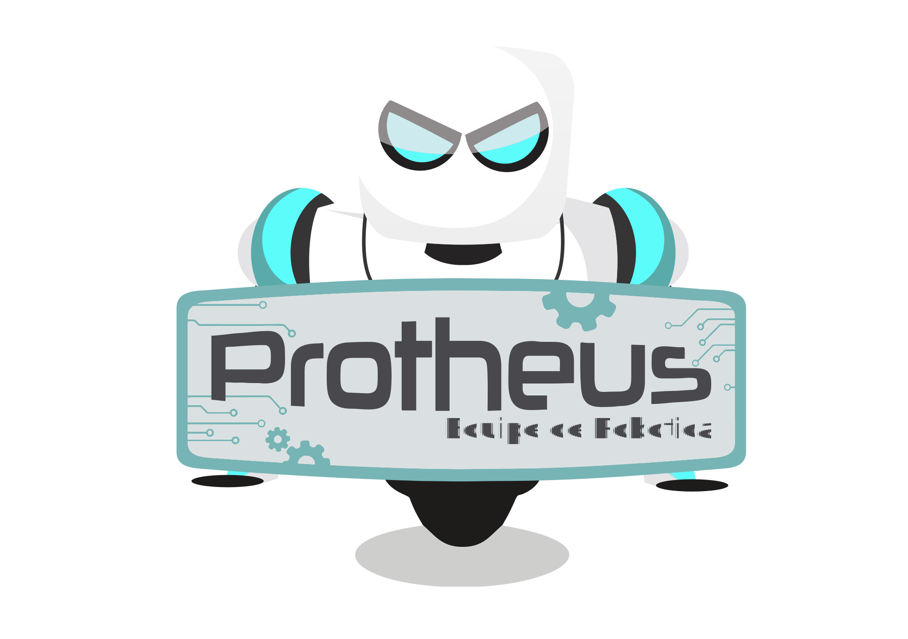
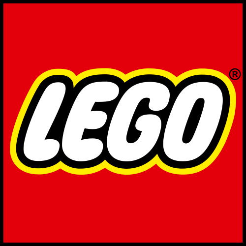
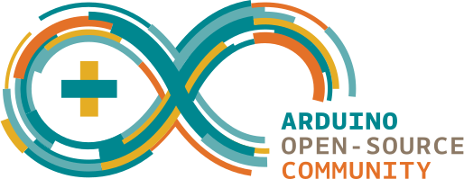

# Protheus

Equipe de robótica do Instituto Federal de Pernambuco - Campus Caruaru

Áreas de foco de pesquisas, extensões e ensino:
- Lego Mindstorms aplicados no ensino 
- Controle com microcontroladores 

 

